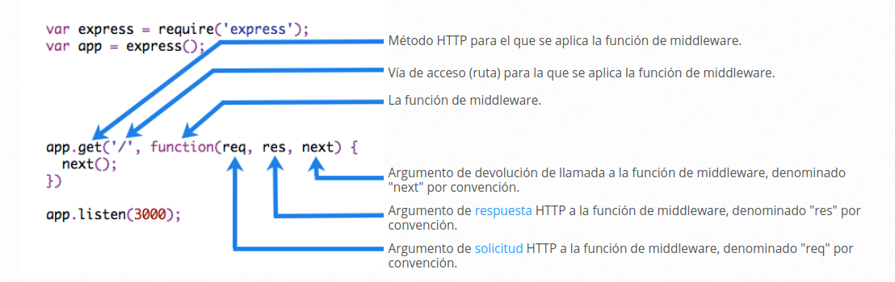
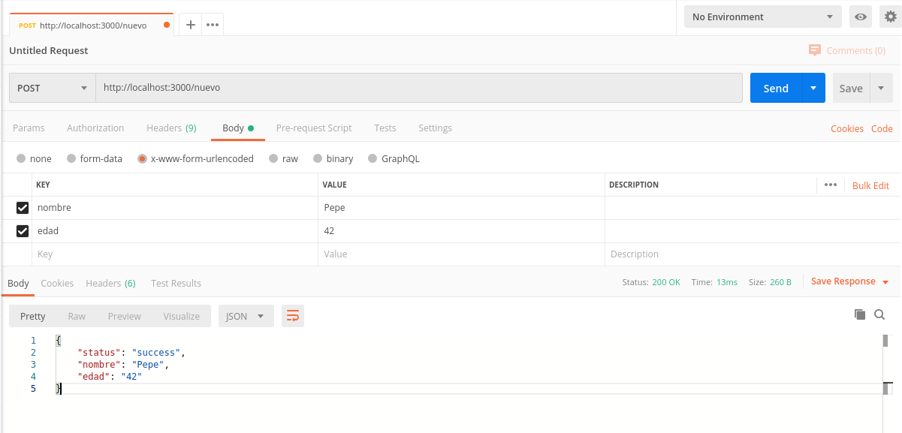
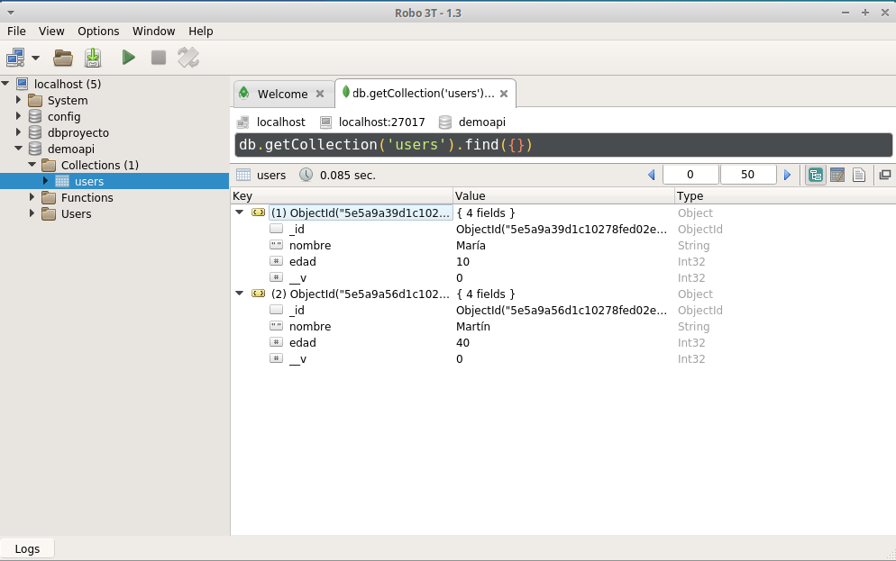
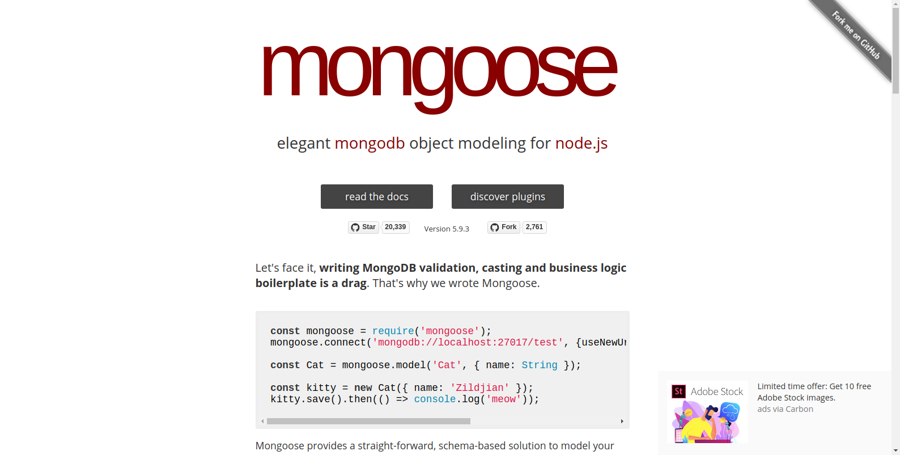
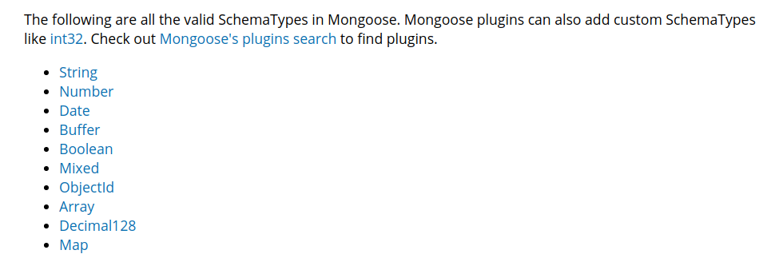

# Crear una API Rest con Node.js y MongoDB

Taller sobre Nodejs, API Rest y MongoDB impartido en las II Jornadas de Informática 2020 del IES Trassierra.

<a name="contenidos"></a>
# Tabla de contenidos
00. [Requisitos ](#00)
01. [Hola Mundo con Node ](#01)
02. [Iniciar proyecto e instalando módulos con npm. ](#02)
03. [ Servidor con Express ](#03)
04. [Peticiones HTTP ](#04)
05. [Estructura del proyecto ](#05)
06. [Manejadores de rutas.  ](#06)
07. [Conexión a la BBDD con Mongoose ](#07)
08. [Modelos ](#08)
09. [Controladores ](#09)


<a name="00"></a>
# 00 Requisitos
[Ir Contenidos ](#contenidos)

- [Nodejs](https://nodejs.org/es/)
- [npm]()
- [ExpressJS]()
- [MongoDB]()
- Cliente REST [Postman]() / [Insommnia]()
- Editor de código. Ej [Visual Studio Code](https://code.visualstudio.com/)

## Instalación Node

**Windows**

- [Documentación oficial Nodejs](https://nodejs.org/es/download/)
- [Documentación oficial. Install Mongodb on Windows](https://docs.mongodb.com/manual/tutorial/install-mongodb-on-windows/)

**Linux**

- [Cómo instalar Node.js en Ubuntu 18.04](https://www.digitalocean.com/community/tutorials/como-instalar-node-js-en-ubuntu-18-04-es)

```
sudo apt update
sudo apt install nodejs
sudo apt install npm
```

Actualizar la versión npm

```
npm install npm@latest -g
```

**Revisando que todo vaya bien....**

```
nodejs -v
npm -v
```

## Instalación MongoDB

**Windows**

- [Install Mongodb on windows/](https://docs.mongodb.com/manual/tutorial/install-mongodb-on-windows/)

**Linux**

- [Install MongoDB Community Edition](https://docs.mongodb.com/manual/tutorial/install-mongodb-on-ubuntu/)

<a name="01"></a>
# 01 'Hola mundo' con Javascript
[Ir Contenidos ](#contenidos)

- Creamos un archivo *holamundo.js*

```javascript

// holamundo.js

console.log("Hola IES Trassierra')
```

- Desde terminal ejecutamos el archivo

```
node holamundo.js
```
<a name="02"></a>
# 02 Iniciar proyecto e instalando módulos con npm
[Ir Contenidos ](#contenidos)

Además de ser el instalador de paquetes de Node, **npm** permite lanzar comandos para iniciar un proyecto, instalar, desinstalar dependencias, buscar paquetes...

- Creamos la carpeta */demoapi*.

```
mkdir demoapi
cd demoapi
```

- Con *npm init* se ejecuará un asistente para completar la información del proyecto. Al terminar se habrá creado el archivo *package.json*  donde queda refelejado la configuración del proyecto.

```
npm init 
```


Dentro de *package.json* se definen y manejan características como:

- Nombre de tu proyecto.
- Versión.
- Dependencias.
- Repositorio.
- Autores.
- Licencia.

Más [+info](https://medium.com/noders/t%C3%BA-yo-y-package-json-9553929fb2e3)

### Instalando módulos.

Usamos los comandos [npm](https://www.npmjs.com/) para instalar lo módulos que necesitemos.  Accediendo a la página de npm podremos localizar el módulo que y consultar información asociada su uso.


La instalación puede hacerse de forma global (equipo) o solo para proyecto (dependencias): 

```
npm install -g <nombre-paquete>
npm install <nombre-paquete> --save
npm -i <nombre-paquete> -S
```

Otros comandos de npm

```
npm uninstall <nombre-paquete> 
npm update <nombre-paquete>
npm install nodemon --save-dev
```

- Instalamos el paquete Express

```
npm install express -S
```

- Comprobamos que se ha creado la carpeta **/node_modules** y se ha añadido Express como dependencia de nuestro proyecto.


<a name="03"></a>
# 03 Servidor con Express
[Ir Contenidos ](#contenidos)

- Creamos el archivo *server.js* y añadimos el siguiente código.

```javascript

// server.js

// Incluimos el módulo con require y creamos una aplicación de Express.

const express = require('express'); 
const app = express();

// Definición de ruta que que se llamará cuando se realice una petición GET
// que ejecutará una función (callback) que nos envía un conjunto de caracteres
// como respuesta.

app.get('/', function (req, res) {
  res.send('Hola Trassierra');
});

// Define y crea el servidor, escuchando el puerto 3000 
// e imprime un comentario en la consola.

app.listen(3000, function () {
  console.log('Servidor escuchando en el puerto 3000!');
});

```

- Arrancamos el servidor

```
node server
```

- Desde un navegador accedemos a la URL [http://localhost:3000/](http://localhost:3000/)

- Modificamos el mensaje por 'Hola DAW'

- Para aplicar los cambios debemos parar el servicio con *Ctrl+c* y volver a inicarlo.

## Nodemon


[Nodemon](https://nodemon.io/) es una librería que reinicia el servidor automáticamente tras salvar cambios. 

- Instalamos Nodemon como dependencia de desarrollo.

```
npm install --save-dev nodemon
```

- Creamos un script dentro de nuestro *package.json* para lanzarlo con *npm*

```json
// package.json

  "scripts": {
    "dev": "nodemon server.js"
  },
```

- Lanzamos nuestro servidor con Nodemon usando *npm run nombrescript*

```
npm run dev
```

- Cambiamos el texto para la petición GET y vemos como se actualiza sin necesidad de reiniciar el servicio.


<a name="04"></a>
# 04 Peticiones HTTP
[Ir Contenidos ](#contenidos)

## GET

Elementos de la llamada.

* Método HTTP
* Ruta
* Callback. Parámetros de petición/respesta/error
* Formato del objeto respuesta mediante middleware de Express



Creamos una petición GET que nos devuelve un objeto JSON

```javascript
// server.js

app.get('/pelicula', function(req, res) {
    res.json({
        "nombre": "El Señor de los Anillos",
        "año": "2012"
    })
})
```

Podemos pasar arrays de objetos.

```javascript

// server.js

let peliculas = [{
        "id": "1",
        "nombre": "Superman",
        "año": "2012"
    },
    {
        "id": "2",
        "nombre": "Batman",
        "año": "2014"
    },
    {
        "id": "3",
        "nombre": "El Señor de los Anillos",
        "año": "2012"
    }
]

app.get('/peliculas', function(req, res) {
    res.json(peliculas)
})
```

Cons *req.params* podemos usar los parámetros de la petición.

```javascript
// server.js

app.get('/usuario/:nombre/:edad', function(req, res) {
    let nombre = req.params.nombre
  
    res.send(`Hola ${nombre}`)
})

```

Dentro de la ruta puede usarse expresiones regulares para validar la url.

```javascript
// server.js

// La URL debe de contener una cadena de 8 números y una letra en mayúscula
app.get('/dni/:id([0-9]{8}[A-Z]{1})', function(req, res) {
    res.send('DNI: ' + req.params.id);
});
```
Más info sobre [rounting con Express](https://expressjs.com/es/guide/routing.html)

## POST

Para manejar la solicitud de HTTP POST en Express.js version 4 y superior, necesitamos tener instalado un módulo de middleware llamado [body-parser](https://www.npmjs.com/package/body-parser).

**body-parser** extrae toda la parte del cuerpo de una secuencia de solicitud entrante y la expone en *req.body*.

```
npm install body-parser --save
```

- bodyParser.urlencoded () : analiza el texto como datos codificados de URL (formularios POST) y expone el objeto resultante (que contiene las claves y valores) en req.body. 
- bodyParser.json () : analiza el texto como JSON y expone el objeto resultante en req.body.


Lo añadimos a *server.js* con require()

```javascript
// server.js

const bodyParser = require('body-parser')


app.use(bodyParser.json());
app.use(bodyParser.urlencoded({
    extended: true, // permite el uso de rich objects y arreglos codificados
}));
```

- Modificamos el código para forzar que los datos existan y añadir un mensaje de error.

```javascript

// server.js

app.post('/nuevo', function(req, res) {
    let { nombre, edad } = req.body;
    if (nombre && edad) {
        res.json({
            status: "success",
            nombre,
            edad
        });
    } else {
        res.json({
            status: "fail",
            message: "Falta algún parámetro"
        });
    }

});
```

### Testeo de petición POST

Para probarlo podemos usar CURL. También [disponible para Windows](https://curl.haxx.se/windows/)

```
curl --data "nombre=Pepe&edad=30" -X POST http://localhost:3000/nuevo
```

Pero es más cómodo usar herramientas para testear API como [Postman](https://www.postman.com/) o [Insomnia](https://insomnia.rest/)

- Instalamos *Postman* y probamos la petición POST.
    - Selecionamos POST como tipo de petición
    - Introducimos la url
    - Simularemos la entrada desde un formulario  eligiendo en la sección *body* e indicamos que el tipo de contenido es *x-www-form-urlencoded*



<a name="05"></a>
# 05 Estructura del proyecto
[Ir Contenidos ](#contenidos)

Es necesario crear una **estructura básica**. Node te da libertad para ello. Pero esta libertad también puede crear "caos".


**Estructura en arquitectura lógica**
- /controladores
  - cliente_controlador.js
  - bar_controlador.js
  - ...
- /modelos
  - cliente_modelo.js
  - bar_modelo.js
- /vistas
  - cliente_vista.js
  - bar_vista.js
- /test
  - cliente_test.js
  - bar_test.js


**Estructura basada en componentes**
- /componente
  - /cliente
    - cliente_modelo.js
    - cliente_controlador.js
    - cliente_test.js
    - ...
  - /bar
    - bar_modelo.js
    - bar_controlador.js
    - bar_test.js


Vamos a usar una estructura basada en la arquitectura lógica. Creamos las siguientes carpetas dentro nuestro proyecto */demoapi*.

  - /models
  - /controllers
  - /routes
  
```
mkdir controllers routes models
```

<a name="06"></a>
# 06 Manejadores de rutas. 
[Ir Contenidos ](#contenidos)

Al independizar/agrupar archivos en carpetas/fiheros debemos configurarlos para que pueden ser leídos desde otros módulos

- Llamamos a un módulo mediante la función *require()*
- Para permitir que las funciones o variables de un módulo puedan ser usadadas debemos indicarlo con *module.export*:

```javascript

// De forma indiviudla por cada variable/función
module.export.nombre_variable
module.export.nombre_funcion

// Dentro de un array
module.export = {
  nombre_variable,
  nombre_funcion
}
```

Vamos a aplicar este concepto para separar nuestro archivo de rutas.

- Borramos las peticiones del archivo *server.js*
- Creamos archivo *peliculasRoute.js* dentro de la carpeta */routes*
- Obtenemos los módulos necesarios.
- Vamos a crear las rutas para nuestro CRUD. 
- Debemos añadir el método que exporta las variables y funciones.

```Javascript

// routes/peliculasRoute.js

const express = require('express');
const router = express.Router();

router.get('/peliculas', function(req, res) {
    res.send("GET  listado de películas")
})
router.get('/peliculas/:id', function(req, res) {
    res.send("GET pelicula por ID")
})
router.get('/peliculas/titulo/:titulo', function(req, res) {
    res.send("GET busca película texto del título")
})
router.get('/peliculas/cartelera/:encartelera', function(req, res) {
    res.send("GET listado de películas que están/no están en cartelera")
})
router.post('/peliculas', function(req, res) {
    res.send("POST Nueva película")
})
router.put('/peliculas/:id', function(req, res) {
    res.send("PUT Actualiza película por ID")
})
router.delete('/peliculas/:id', function(req, res) {
    res.send("DELETE Borra película por ID")
})

module.exports = router;
```

- Usamos *require()* para añadir las nuevas funciones en *server.js*. Las nuevas entradas de nuestra API Rest usarán el prefijo **/api**

```Javascript

// server.js

const apiRoutes = require('./routes/peliculasRoutes');

app.use('/api', apiRoutes);

```

- Probamos en Postman

<a name="07"></a>
# 07 Conexión a la BBDD con Mongoose
[Ir Contenidos ](#contenidos)

- Revisar si tenemos MongoDB instalado.

REVISARRRRRRRRRRRRRRRRR WIN

```
mongo
```

- Linux. Comprobamos que tenemos el servidor de MongoDB iniciado.

```
sudo service mongod status
```

- Para iniciar/parar el servicio

```
sudo service mongod start
sudo service mongod stop
```

**GUI para MongoDB**

Podemos facilitarnos la vida usando alguno de estos programas para gestionar nuestra DB No Relacional.

- [Compass](https://www.mongodb.com/products/compass) viene con la instalación de MongoDB
- Robo3T [https://robomongo.org/](https://robomongo.org/)



## Conexión mediante Mongoose

[Mongoose](https://mongoosejs.com/) es una librería que permite crear modelos de objetos. Está diseñado para trabajar en entornos asíncronos. Mongoose soporte tanto promesas como callbacks.



Si queremos desarrollar nuestra capa de datos con **bases de datos SQL (Postgres, MySQL, MariaDB, SQLite and Microsoft SQL Server)** podemos usar [Sequelize](https://sequelize.org/)

- Instalamos Mongoose como dependencia del proyecto.

```
npm i mongoose -S
```

- Añadimos el módulo y la conexión a *server.js*

```Javascript

// server.js

const mongoose = require('mongoose');


mongoose.connect('mongodb://localhost:27017/apipeliculas', {
        useNewUrlParser: true,
        useUnifiedTopology: true,
    })
    .then(
        () => { console.log("Conexión a DB realizada"); },
        (err) => { console.log(`Error en la conexión a la DB${err}`); },
    );
```
<a name="08"></a>
# 08 Modelos
[Ir Contenidos ](#contenidos)

- Dentro de la carpeta */models* creamos nuestro modelo Pelicula.js

```javascript

// models/Pelicula.js

const mongoose = require("mongoose");
const { Schema } = mongoose;

const peliculaSchema = new Schema({
    titulo: { type: String },
    anio: { type: Number },
    encartelera: { type: Boolean },
});

module.exports = mongoose.model("Pelicula", peliculaSchema);
```



Ver [parámetros](https://mongoosejs.com/docs/schematypes.html#)

## Cargamos datos de ejemplo

- Ejecutamos el archivo *addPeliculas.js* para añadir unas películas de ejemplo.

```
node data/addPeliculas
```
<a name="09"></a>
# 09 Controladores
[Ir Contenidos ](#contenidos)

Estos archivos van a almacenar la lógica de nuestro proyecto.

## 1 GET Listado de películas con find()

- Nuevo archivo *peliculasController.js* en la carpeta */controllers*
- Creamos la primera función que nos va a devolver el listado de películas. Para ellos usamos la función *find()*

```javascript

// Archivo: controllers/peliculasController.js

// Añadimos el modelo
const Pelicula = require("../models/Pelicula");

// GET Listado Películas
const peliculaList = (req, res) => {
    Pelicula.find((err, peliculas) => {
        if (err) {
            res.status(400).json({
                status: 0,
                message: "Error",
            });
        } else {
            res.status(200).json(peliculas);
        }
    });
};

// Exportamos la función para ser usada
module.exports = {
    peliculaList,
};

```

- Cambiamos la función genérica usada en el archivo de rutas para que use la función definida en el controlador. Antes debemos importar el archivo y luego añadir la función correspodiente.

```javascript

//Archivo: peliculasRouter.js

const peliculaController = require('../controllers/peliculasController')


router.get('/peliculas', peliculaController.peliculaList)

```

- Testeamos

[http://localhost:3000/api/peliculas](http://localhost:3000/api/peliculas)

## 2 GET Detalle de pelígula por id *findById()*

- Usamos la función *findById()*  y la añadimos al array para exportarla

```javascript
// controllers/peliculasController.js

// GET Detalle de PELICULA por ID
const peliculaDetail = (req, res) => {
    let { id } = req.params;
    Pelicula.findById(id, (err, pelicula) => {
        if (err) {
            res.json({
                status: 0,
                message: "No existe un PELICULA con ese ID ",
            });
        } else res.json(pelicula);
    });
};

// Exportamos la función para ser usada

module.exports = {
    peliculaList,
    peliculaDetail
};

```
- Para probar debemos copiar el id de una de las películas y añadirlas a la URL.

[http://localhost:3000/api/peliculas/5e6361f779f94546e47ffdd5](http://localhost:3000/api/peliculas/5e6361f779f94546e47ffdd5)


## 3 GET Películas en cartelera *find()* sobre un campo

- Peliculas en cartelera y devolver total

```javascript
// controllers/peliculasController.js

// Peliculas en cartelera con  total de resultados
const peliculaByCartelera = (req, res) => {
    let { encartelera } = req.params;

    Pelicula.find({ encartelera }, (err, pelicula) => {
        if (err) {
            res.json({
                status: 0,
                message: "No existe registros ",
            });
        } else res.json({
                'total': pelicula.length,
                pelicula
            }

        );
    });
};
```

[http://localhost:3000/api/peliculas/cartelera/false](http://localhost:3000/api/peliculas/cartelera/false)


- Podemos ordernar el resultado

```javascript
// controllers/peliculasController.js

// GET Películas en cartelera con  total de resultados
const peliculaByCartelera = (req, res) => {
    let { encartelera } = req.params;

    Pelicula.find({ encartelera }, null, { sort: { anio: -1 } }, (err, pelicula) => {
        if (err) {
            res.json({
                status: 0,
                message: "No existe registros ",
            });
        } else res.json({
            'total': pelicula.length,
            pelicula
        });
    });
};
```

## 5 GET Búsqueda de película por texto en find() y  Expresión regular

- Usamos una expresión regular para buscar una cadena de texto en el título.

```javascript

// controllers/peliculasController.js

// Detalle de PELICULA por Título
const peliculaByTitle = (req, res) => {
    let { titulo } = req.params;

    Pelicula.find({ titulo }, (err, pelicula) => {
        if (err) {
            res.json({
                status: 0,
                message: "No existe un PELICULA con ese título ",
            });
        } else res.json(pelicula);
    });
};
```

[http://localhost:3000/api/peliculas/titulo/Reservoir%20dogs](http://localhost:3000/api/peliculas/titulo/Reservoir%20dogs)


- Búsqueda por texto en título usando expresión regular.

```javascript
// controllers/peliculasController.js

// Detalle de PELICULA por Título
const peliculaByTitle = (req, res) => {
    let { titulo } = req.params;

    Pelicula.find({ titulo: { $regex: new RegExp(titulo, "i") } }, (err, pelicula) => {
        if (err) {
            res.json({
                status: 0,
                message: "No existe un PELICULA con ese título ",
            });
        } else res.json(pelicula);
    });
};

```


## 6 POST Crear nueva película save()

- Creamos la función.
- La hacemos exportable dentro del módulo
- Modificamos la función en peliculasRoute.js
- Reiniciamos
- Testeamos en Postman

```javascript

// controllers/peliculasController.js

// POST Crea Película
const peliculaCreate = (req, res) => {
    let { titulo, anio, encartelera } = req.body;

    let pelicula = new Pelicula({
        titulo,
        anio,
        encartelera
    });

    // Usamos Promesas
    pelicula
        .save()
        .then(pelicula => {
            res.status(200).json({
                state: 1,
                message: "Película creada",
                pelicula
            });
        })
        .catch(err => {
            res.status(500).send({
                state: 0,
                message: err.message
            });
        });
};

module.exports = {
    peliculaList,
    peliculaDetail,
    peliculaByTitle,
    peliculaByCartelera,
    peliculaCreate,
};
```

## 7 PUT Actualizar datos de una película findByIdAndUpdate()

- Creamos la función.
- La hacemos exportable dentro del módulo
- Modificamos la función en peliculasRoute.js
- Reiniciamos
- Testeamos en Postman

```javascript

// controllers/peliculasController.js

// PUT Actualiza Película

const peliculaUpdate = (req, res, next) => {

    Pelicula.findById(req.params.id, (err, pelicula) => {
        if (!pelicula) {
            return res.status(400).json({
                state: 0,
                message: "No se ha encontrado película con id indicado ",
                message: err.message,
            });
        }

        let { id } = req.params;
        let { body } = req;

        Pelicula.findByIdAndUpdate(id, body, { new: true }, (err, peliculaDB) => {

            if (err) {
                return res.status(500).json({
                    state: 0,
                    message: err.message,
                });
            }
            res.status(200).json({
                state: 1,
                message: "Película actualizada",
                peliculaDB,
            });
        });
    });
};

module.exports = {
    peliculaList,
    peliculaDetail,
    peliculaByTitle,
    peliculaByCartelera,
    peliculaCreate,
};
```


## 8 DELETE Borrar película findByIdAndRemove()

- Creamos la función.
- La hacemos exportable dentro del módulo
- Modificamos la función en peliculasRoute.js
- Reiniciamos
- Testeamos en Postman

```javascript

// controllers/peliculasController.js

// DELETE Borrar película
const peliculaDelete = (req, res) => {

    Pelicula.findByIdAndRemove({ _id: req.params.id }, (err, pelicula) => {
        if (err) {
            return res.status(500).json({
                state: 0,
                message: err,
            });
        }

        if (!pelicula) {
            return res.status(400).json({
                state: 0,
                message: "Película no encontrada",
            });
        }

        res.status(200).json({
            state: 1,
            pelicula: pelicula.titulo,
            message: "Película borrada",

        });
    });
};
```

# 99 2Do
- Control de errores
- Securizar la API
- Tests
- Variables de configuración (despliegues)
- Más sobre Mongoose ()
    - Fechas
    - Validaciones
    - Populates
    - get/set
    - virtual


# 99 test

- Navegador
- Uso del comando  curl

```
curl --location --request GET 'http://localhost:3000/'
```
- Aplicaciones para testeto de API, ej. [Postman](https://www.postman.com/).
- Creando test. Mocha y chai nos permiten crear pruebas unitarias
  - [Mocha](https://mochajs.org/). Marco de prueba de JavaScript para Node.js
  - [Chai](https://www.chaijs.com/) Librería JS sobreescribe el método assert añadiendo algunas posibilidades, como comprobar que un valor es mayor o menor que uno dado, o que un objeto no es null. Chai is an assertion library, similar to Node's built-in assert. It makes testing much easier by giving you lots of assertions you can run against your code.
  Chai tiene varias interfaces: assert, expect y should, que permiten al desarrollador elegir el estilo que le resulte más legible y cómodo a la hora de desarrollar sus tests

Instalación como dependencias de desarrollo
```
npm install chai mocha --save-dev
```

Creamos carpeta *tests* dentro del proyacto

```
mkdir test
```

Creamos un script dentro de *package.json* para lazar nuestros test.

```json
 "scripts": {
        ...
        "test": "mocha tests/*.js --exit",
        ...
    },
```

### Creando un test

Describe

En esta parte definimos bloques de pruebas podemos tener varios bloques de pruebas y relacionarlos entre sí en otras palabras es una descripción general de nuestras pruebas.

It

Los it se refiere a cada una de las pruebas es decir dentro de un describe podemos tener varios it que son las pruebas de eses describe.
