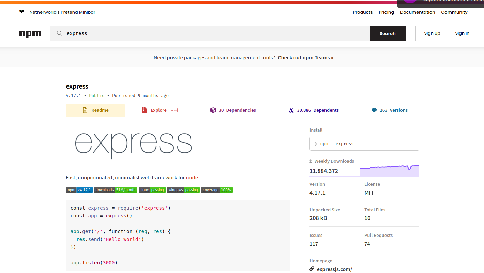
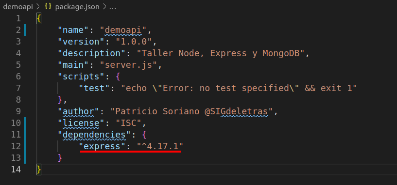
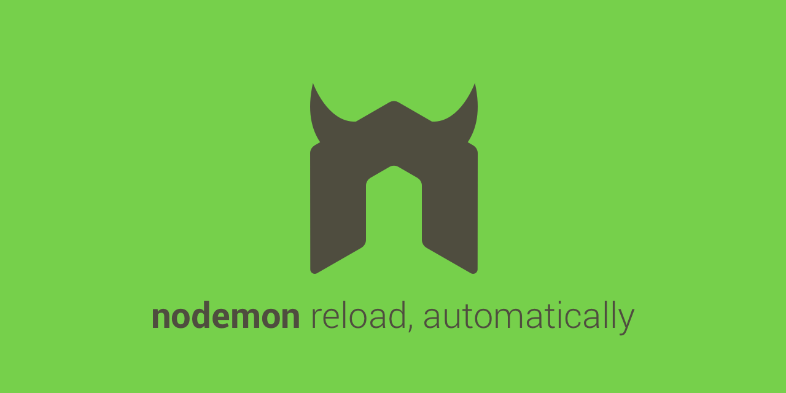
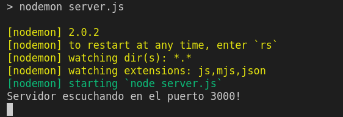

# Montando una APIRest con Nodejs, Express y MongoDB

Taller sobre Nodejs, APIRest y Mongo impartido en la Jornadas de Informática 2020 del IES Trassierra

# 0. Requisitos

- [Nodejs](https://nodejs.org/es/)
- [npm]()
- [ExpressJS]()
- [MongoDB]()
- Cliente REST [Postman]() / [Insommnia]()
- Editor de código. Ej [Visual Studio Code](https://code.visualstudio.com/)

## Instalación

## Windows

- [https://nodejs.org/es/download/](https://nodejs.org/es/download/)

### Linux

- [Cómo instalar Node.js en Ubuntu 18.04](https://www.digitalocean.com/community/tutorials/como-instalar-node-js-en-ubuntu-18-04-es)

```
sudo apt update
sudo apt install nodejs
sudo apt install npm
```

Actualizar la versión npm

```
npm install npm@latest -g
```

Revisando que todo vaya bien....

```
nodejs -v
npm -v
```

# 01 'Hola mundo' con Javascript


Creamos un archivo *holamundo.js*

```javascript
console.log("Hola IES Trassierra')
```

Desde terminal ejecutamos el archivo

```
node holamundo.js
```

Podemos abrir node desde consola. Es igual que si abrimos las Herramientas de desarrollador de nuestro navegador.

# 02 Iniciar proyecto e instalando módulos con NPM

Además de ser el instalador de paquetes de Node, **npm** permite lanzar comandos para iniciar un proyecto o instalar dependencias.

- Creamos la carpeta 'demoapi'.

```
mkdir demoapi
cd demoapi
```

- Inicializamos el proyecto creando el archivo *package.json*. Iremos completando la información del asistente. 

```
npm init 
```


Dentro de *package.json* se definen y manejan características como:

- Nombre de tu proyecto.
- Versión.
- Dependencias.
- Repositorio.
- Autores.
- Licencia.

Más [+info](https://medium.com/noders/t%C3%BA-yo-y-package-json-9553929fb2e3)

### Instalando módulos.

Usamos los comandos [npm](https://www.npmjs.com/) para instalar lo módulos que necesitemos.  Accediendo a la página de npm podremos localizar el módulo que necesitemos con información sobre su uso.



La instalación puede hacerse de forma global o para el proyecto: 

Instalación global (con permisos root)

```
npm install -g <nombre-paquete>
```

Instalación dentro del proyecto. Se añade en el apartado de dependencias de *package.json*

```
npm install <nombre-paquete> --save
npm -i <nombre-paquete> -S
```

Otros comandos

```
npm uninstall <nombre-paquete> //
npm update <nombre-paquete>
npm install nodemon --save-dev
```

- Instalamos el paquete Express
```
npm install express -S
```

Comprobamos que se ha creado la carpeta **/node_modules** y se ha añadido Express como dependencia de nuestro proyecto.



**Si ya tuviéramos el archivo de instalación podríamos instalarlo con npm install**

```
npm install
```

# 03 Servidor con ExpressJS

- Creamos el archivo de entrada *server.js* del proyecto, en este caso el que monta un servidor. Añadimos el siguiente código.

```javascript

// Incluimos el módulo mediante require y creamos una aplicación de Express.

const express = require('express'); 
const app = express();

// Definición de ruta que que se llamará cuando se realice una petición GET
// que ejecutará una función (callback) que nos envía un conjunto de caracteres
// como respuesta.

app.get('/', function (req, res) {
  res.send('Hola Trassierra');
});

// Define y crea el servidor, escuchando el puerto 3000 
// e imprime un comentario en la consola.

app.listen(3000, function () {
  console.log('Servidor escuchando en el puerto 3000!');
});

```

- Arrancamos el servidor

```
node server
```

- Accedemos a [http://localhost:3000/](http://localhost:3000/)

- Modificamos el mensaje por el de 'Hola DAW'
- Para aplicar los cambios debemos para el servicio con *Ctrl+c*

## Nodemon



[Nodemon](https://nodemon.io/) es una librería que reinicia el servidor automáticamente tras salvar cambios. 

- Instalamos nodemon como dependencia de desarrollo.
```
npm install --save-dev nodemon
```

- Creamos un script dentro de nuestro package.json para lanzarlo con *npm*

```
  "scripts": {
    "dev": "nodemon server.js"
  },
```

- Lanzamos nuestro servidor con Nodemon usando *npm run <nombrescript>*

```
npm run dev
```

- Cambiamos el texto para la petición GET y vemos como se actualiza sin necesidad de reiniciar el servicio.



# 04 Peticiones HTTP


GET

- Método HTTP
- Ruta
- Callback. Parámetros de petición/respesta/error
- Formato del objeto respuesta mediante middleware de Express

```javascript
app.get('/pelicula', function(req, res) {
    res.json({
        "nombre": "El Señor de los Anillos",
        "año": "2012"
    })
})
```

Podemos pasar arrays de objetos
```javascript
let peliculas = [{
        "id": "1",
        "nombre": "Superman",
        "año": "2012"
    },
    {
        "id": "2",
        "nombre": "Batman",
        "año": "2014"
    },
    {
        "id": "3",
        "nombre": "El Señor de los Anillos",
        "año": "2012"
    }
]

app.get('/peliculas', function(req, res) {
    res.json(peliculas)
})
```

- Para obtener los parámetros

Nencesitamos añadir los middleware de Express url-encode y json en server.jos

var bodyParser = require('body-parser')

Atención a POST

npm install body-parser --save

pruebas post

explicar los application type


## 05 Añadir carpeta para servir archivos estáticos**

Para el servicio de archivos estáticos como, por ejemplo, imágenes, archivos CSS y archivos JavaScript, usamos la función de middleware incorporado express.static de Express.

- Crear una carpeta llamada /public

Definimos el acceso virtual (/static) que accede a la carpeta /public mediane la vía de acceso absoluta del directorio al que desea dar servicio.

```Javascript
app.use('/static', express.static(__dirname + '/public'));
```

# 06 Manejadores de rutas. Importación de módulos. 

Es necesario crear una **estructura básica**. Node te da libertad para ello. Pero esta libertad también puede crear "caos".

**Estructura basada en componentes**
- /componente
  - /cliente
    - cliente_modelo.js
    - cliente_controlador.js
    - cliente_test.js
    - ...
  - /bar
    - bar_modelo.js
    - bar_controlador.js
    - bar_test.js


**Estructura en arquitectura lógica**
- /controladores
  - cliente_controlador.js
  - bar_controlador.js
  - ...
- /modelos
  - cliente_modelo.js
  - bar_modelo.js
- /vistas
  - cliente_vista.js
  - bar_vista.js
- /test
  - cliente_test.js
  - bar_test.js


Al independizar/agrupar archivos en carpetas/fciheros debemos configurarlos para que pueden ser leídos desde otros módulos

- Llamamos a un módulo mediante la función require()
- Para permitir que las funciones o variables de un módulo puedan ser usadadas debemos indicarlo con

```javascript
module.export.nombre_variable
module.export.nombre_funcion

module.export = {
  nombre_variable,
  nombre_funcion
}
```

Vamos a aplicar este concepto para separa nuestro archivo de rutas

- Creamos la carpeta *routes*
- Creamos archivo *apiRoutes.js*
- Obtenemos los módulos necesarios

```Javascript
const express = require('express');
const router = express.Router();
```

- Pasamos las peticiones del archivo server.js al nuevo fichero. Debemos modificar el código para que usar la constante router

```Javascript
router.get('/users', function(req, res) {
    res.json(usuarios)
})

router.get('/user/:nombre/:edad', function(req, res) {
    let nombre = req.params.nombre
    let edad = req.params.edad

    res.send(`Hola ${nombre}. Tienes  ${edad} años.`)
})
```
- Debemos añadir el método que exporta las variables y funciones

```Javascript
module.exports = router;
```

- Usamos require para usar el nuevo archivo en server.js y lo usamos añadiendo el prefijo /api a todas las peticiones creadas en el archivo

```Javascript
const apiRoutes = require('./routes/apiRoutes');
app.use('/api', apiRoutes);

```

# Base de datos Mongo

https://tutobasico.com/instalar-mongodb-win10/
https://docs.mongodb.com/manual/tutorial/install-mongodb-on-windows/
Video https://www.youtube.com/watch?v=2KMQdqDk9e8


https://www.digitalocean.com/community/tutorials/como-instalar-mongodb-en-ubuntu-18-04-es
https://docs.mongodb.com/manual/tutorial/install-mongodb-on-ubuntu/


Comprobamos que tenemos el servidor de mongodb iniciado

```
sudo service mongod status
```

Para iniciar/parar

```
sudo service mongod start
sudo service mongod stop
```
**GUI**

- Compass
- Robo 3T [https://robomongo.org/](https://robomongo.org/)


## Conexión mediante Mongoose

Mongoose is a MongoDB object modeling tool designed to work in an asynchronous environment. Mongoose supports both promises and callbacks.

- Instalamos mongoose

```
npm i mongoose -S
```

Añadimos el módulo y la conexión a *server.js*

```Javascript
const mongoose = require('mongoose');

mongoose.connect('mongodb://localhost:27017/demoapi', {
        useNewUrlParser: true,
        useUnifiedTopology: true,
    })
    .then(
        () => { console.log("Conexión a DB realizada"); },
        (err) => { console.log(`Error en la conexión a la DB${err}`); },
    );
```

## 08 Creando modelos con Mongoose

- Creamos una nueva capa *models*


## 08 Creando controladores

- Creamos una nueva capa *controllers*


# 99 test

- Navegador
- Uso del comando  curl

```
curl --location --request GET 'http://localhost:3000/'
```
- Aplicaciones para testeto de API, ej. [Postman](https://www.postman.com/).
- Creando test. Mocha y chai nos permiten crear pruebas unitarias
  - [Mocha](https://mochajs.org/). Marco de prueba de JavaScript para Node.js
  - [Chai](https://www.chaijs.com/) Librería JS sobreescribe el método assert añadiendo algunas posibilidades, como comprobar que un valor es mayor o menor que uno dado, o que un objeto no es null. Chai is an assertion library, similar to Node's built-in assert. It makes testing much easier by giving you lots of assertions you can run against your code.
  Chai tiene varias interfaces: assert, expect y should, que permiten al desarrollador elegir el estilo que le resulte más legible y cómodo a la hora de desarrollar sus tests

Instalación como dependencias de desarrollo
```
npm install chai mocha --save-dev
```

Creamos carpeta *tests* dentro del proyacto

```
mkdir test
```

Creamos un script dentro de *package.json* para lazar nuestros test.

```json
 "scripts": {
        ...
        "test": "mocha tests/*.js --exit",
        ...
    },
```

### Creando un test

Describe

En esta parte definimos bloques de pruebas podemos tener varios bloques de pruebas y relacionarlos entre sí en otras palabras es una descripción general de nuestras pruebas.

It

Los it se refiere a cada una de las pruebas es decir dentro de un describe podemos tener varios it que son las pruebas de eses describe.
